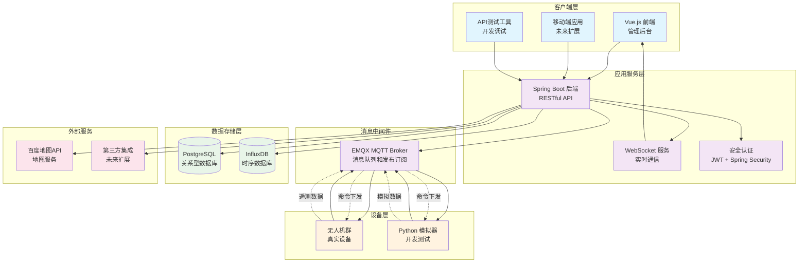
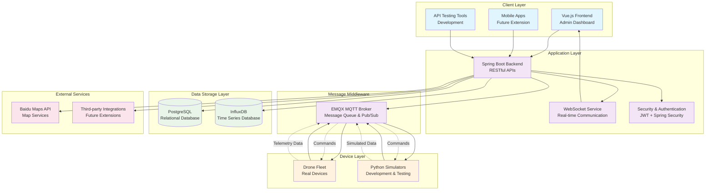

# 🚁 Drone9 - 无人机管理系统

[](https://github.com/Mayoruang/drone9/blob/main/LICENSE)
[](#)
[](#)

无人机管理系统，具备实时监控、地理围栏管理、自动化注册流程和基于MQTT的通信协议。

## 🌟 核心功能

### 🛡️ **地理围栏管理**
- 基于交互式地图的围栏创建和编辑
- 支持多种围栏类型（禁飞区、限制区、允飞区）
- 基于高度的限制和时间限制围栏
- 使用百度地图API实时生成缩略图
- 高级违规检测和报告

### 🚁 **无人机注册与管理**
- 流畅的无人机注册工作流程
- 管理员审批/拒绝系统
- 自动化MQTT凭证分配
- 实时状态监控和健康检查
- 基于WebSocket的实时更新

### 📊 **实时监控**
- 实时遥测数据可视化
- 地图上的交互式无人机跟踪
- 历史飞行路径分析
- 系统健康和性能指标
- 警报和通知系统

### 🔄 **MQTT通信**
- 安全、可扩展的MQTT消息代理集成
- 双向命令和控制能力
- 实时遥测数据流
- 自动连接管理和恢复

## 🏗️ 系统架构



## 🛠️ 技术栈

### 后端技术
- **框架**: Spring Boot 3.2+
- **安全**: Spring Security + JWT
- **数据库**: PostgreSQL 15+ (关系型), InfluxDB 2.0+ (时序)
- **消息**: EMQX MQTT Broker
- **ORM**: Spring Data JPA + Hibernate
- **实时通信**: WebSocket, MQTT

### 前端技术
- **框架**: Vue.js 3 + Composition API
- **UI库**: Ant Design Vue 4.0+
- **构建工具**: Vite
- **状态管理**: Pinia
- **地图**: 百度地图API
- **模板**: Vue-Vben-Admin

### 基础设施
- **容器化**: Docker & Docker Compose
- **数据库**: PostgreSQL, InfluxDB
- **消息代理**: EMQX
- **地图服务**: 百度地图静态API

## 🚀 快速开始

### 环境要求
- **Java**: 17 或更高版本
- **Node.js**: 18 或更高版本
- **Docker**: 20.10 或更高版本
- **Python**: 3.8+ (用于无人机模拟器)

### 1. 克隆仓库
```bash
git clone https://github.com/Mayoruang/drone9.git
cd drone9
```

### 2. 启动基础设施服务
```bash
# 启动 PostgreSQL, InfluxDB 和 EMQX
docker-compose up -d postgres influxdb emqx
```

### 3. 启动后端服务
```bash
cd backend
./mvnw spring-boot:run
mvn spring-boot:run -Dspring-boot.run.profiles=network
```

后端服务将在 `http://localhost:8080` 运行

### 4. 启动前端应用
```bash
cd vue-vben-admin/apps/web-antd
npm install
npm run dev
```

前端应用将在 `http://localhost:5173` 运行

### 5. 运行无人机模拟器 (可选)
```bash
# 安装Python依赖
pip install -r requirements.txt

# 启动无人机模拟器
python smart_drone_simulator.py --drones 5
```

## 📱 应用访问地址

- **管理后台**: `http://localhost:5173`
- **API文档**: `http://localhost:8080/swagger-ui.html`
- **EMQX控制台**: `http://localhost:18083` (admin/public)
- **数据库**: PostgreSQL on `localhost:5432`
- **InfluxDB**: `http://localhost:8086`

## 📖 详细配置指南

### 环境配置

1. **数据库设置**: PostgreSQL将自动初始化所需的数据表结构
2. **EMQX配置**: MQTT代理已配置用于无人机认证
3. **InfluxDB**: 时序数据库用于遥测数据存储
4. **百度地图**: 配置API密钥用于地图服务 (可选)

### 配置文件

- `backend/src/main/resources/application.yml` - 后端配置
- `vue-vben-admin/apps/web-antd/.env.local` - 前端环境变量
- `docker-compose.yml` - 基础设施服务配置

### 环境变量示例

```bash
# 后端配置 (application.yml)
spring:
  datasource:
    url: jdbc:postgresql://localhost:5432/drone_management
    username: postgres
    password: password

# MQTT配置
mqtt:
  broker: tcp://localhost:1883
  username: admin
  password: public

# 前端配置 (.env.local)
VITE_GLOB_API_URL=http://localhost:8080/api
VITE_GLOB_APP_TITLE=无人机管理系统
```

## 🔧 开发特性

### 无人机模拟器
系统包含一个功能强大的无人机模拟器，可以：

- 同时模拟多台无人机
- 生成真实的飞行模式
- 通过MQTT发送遥测数据
- 响应远程命令
- 模拟各种飞行场景

```bash
# 使用自定义参数运行模拟器
python smart_drone_simulator.py \
  --drones 10 \
  --backend http://localhost:8080/api/v1 \
  --mqtt-host localhost \
  --mqtt-port 1883 \
  --log-level DEBUG
```

### API测试
使用包含的测试工具：

- `test-api.html` - 交互式API测试界面
- `vue-vben-admin/apps/web-antd/test-geofence.html` - 地理围栏API测试

## 🌐 核心工作流程

### 1. 无人机注册流程
1. 无人机通过API提交注册请求
2. 管理员在控制台审查并批准/拒绝
3. 系统生成MQTT凭证
4. 无人机连接到MQTT代理
5. 开始实时监控

### 2. 地理围栏管理
1. 管理员使用地图界面创建围栏
2. 系统生成地图缩略图
3. 实时强制执行围栏规则
4. 检测并报告违规行为
5. 向相关人员发送警报

### 3. 任务监控
1. 无人机通过MQTT发送遥测数据
2. 系统将数据存储在InfluxDB中
3. 在控制台实时可视化
4. 历史分析和报告

## 📊 数据管理

### 数据库架构
- **PostgreSQL**: 存储无人机注册、用户账户、地理围栏和系统配置
- **InfluxDB**: 存储时序遥测数据、飞行路径和性能指标

### 关键数据模型
- `Drone`: 核心无人机信息和凭证
- `Geofence`: 地理边界和限制
- `DroneRegistrationRequest`: 注册工作流管理
- `TelemetryData`: 实时无人机状态和位置
- `GeofenceViolation`: 安全和合规性跟踪

## 🛡️ 安全特性

- **JWT认证**: 安全的API访问
- **MQTT安全**: 个体无人机凭证
- **基于角色的访问**: 管理员和操作员权限
- **围栏强制执行**: 自动边界检查
- **审计日志**: 完整的活动跟踪

## 🔧 故障排除

### 常见问题

1. **数据库连接错误**
   ```bash
   # 检查PostgreSQL是否运行
   docker ps | grep postgres
   
   # 重置数据库
   docker-compose down postgres
   docker-compose up -d postgres
   ```

2. **MQTT连接问题**
   ```bash
   # 检查EMQX状态
   docker logs emqx
   
   # 测试MQTT连接
   ./check_mqtt_config.sh
   ```

3. **前端构建错误**
   ```bash
   # 清除node_modules并重新安装
   cd vue-vben-admin/apps/web-antd
   rm -rf node_modules package-lock.json
   npm install
   ```

### 性能优化

- **数据库索引**: 通过适当的索引优化查询
- **MQTT调优**: 配置QoS级别和连接池
- **前端缓存**: 实现高效的数据缓存策略
- **时序优化**: 配置InfluxDB保留策略

## 📝 API文档

完整的API文档可在以下位置获取：
- **交互式文档**: `http://localhost:8080/swagger-ui.html`
- **OpenAPI规范**: `http://localhost:8080/v3/api-docs`
- **详细文档**: 参见 `API_DOCUMENTATION.md`

## 🤝 贡献指南

1. Fork 此仓库
2. 创建功能分支: `git checkout -b feature-name`
3. 提交更改: `git commit -am 'Add feature'`
4. 推送到分支: `git push origin feature-name`
5. 提交拉取请求

### 开发指南
- 遵循Spring Boot后端开发最佳实践
- 前端组件使用Vue.js Composition API
- 为新功能编写全面的测试
- API更改时更新文档

## 📄 许可证

本项目为专有软件。保留所有权利。

## 🏗️ 未来路线图

- [ ] **高级分析**: 基于ML的飞行模式分析
- [ ] **移动应用**: 原生iOS/Android应用
- [ ] **多租户支持**: 企业客户隔离
- [ ] **高级围栏**: 3D围栏和动态边界
- [ ] **机群管理**: 自动化任务规划和调度
- [ ] **集成API**: 第三方系统集成

## 📞 技术支持

如需技术支持或有疑问：
- **问题反馈**: [GitHub Issues](https://github.com/Mayoruang/drone9/issues)
- **文档**: 参见 `/docs` 目录
- **邮箱**: 联系系统管理员

---

## English Version / 英文版本

# 🚁 Drone9 - Advanced Drone Management System

A comprehensive, enterprise-grade drone management system featuring real-time monitoring, geofence management, automated registration workflows, and MQTT-based communication protocols.

## 🌟 Key Features

### 🛡️ **Geofence Management**
- Interactive map-based geofence creation and editing
- Support for multiple geofence types (No-Fly Zones, Restricted Areas, Flight Zones)
- Altitude-based restrictions and time-limited geofences
- Real-time thumbnail generation using Baidu Maps API
- Advanced violation detection and reporting

### 🚁 **Drone Registration & Management**
- Streamlined drone registration workflow
- Administrator approval/rejection system
- Automated MQTT credential provisioning
- Real-time status monitoring and health checks
- WebSocket-based live updates

### 📊 **Real-Time Monitoring**
- Live telemetry data visualization
- Interactive drone tracking on maps
- Historical flight path analysis
- System health and performance metrics
- Alert and notification system

### 🔄 **MQTT Communication**
- Secure, scalable MQTT message broker integration
- Bi-directional command and control capabilities
- Real-time telemetry data streaming
- Automatic connection management and recovery

## 🏗️ System Architecture



## 🛠️ Technologies

### Backend
- **Framework**: Spring Boot 3.2+
- **Security**: Spring Security with JWT
- **Database**: PostgreSQL 15+ (Relational), InfluxDB 2.0+ (Time-series)
- **Messaging**: EMQX MQTT Broker
- **ORM**: Spring Data JPA with Hibernate
- **Real-time**: WebSocket, MQTT

### Frontend
- **Framework**: Vue.js 3 with Composition API
- **UI Library**: Ant Design Vue 4.0+
- **Build Tool**: Vite
- **State Management**: Pinia
- **Maps**: Baidu Maps API
- **Admin Template**: Vue-Vben-Admin

### Infrastructure
- **Containerization**: Docker & Docker Compose
- **Database**: PostgreSQL, InfluxDB
- **Message Broker**: EMQX
- **Maps**: Baidu Maps Static API

## 🚀 Quick Start

### Prerequisites
- **Java**: 17 or higher
- **Node.js**: 18 or higher
- **Docker**: 20.10 or higher
- **Python**: 3.8+ (for drone simulators)

### 1. Clone Repository
```bash
git clone https://github.com/Mayoruang/drone9.git
cd drone9
```

### 2. Start Infrastructure Services
```bash
# Start PostgreSQL, InfluxDB, and EMQX
docker-compose up -d postgres influxdb emqx
```

### 3. Start Backend Service
```bash
cd backend
./mvnw spring-boot:run
```

The backend will be available at `http://localhost:8080`

### 4. Start Frontend Application
```bash
cd vue-vben-admin/apps/web-antd
npm install
npm run dev
```

The frontend will be available at `http://localhost:5173`

### 5. Run Drone Simulators (Optional)
```bash
# Install Python dependencies
pip install -r requirements.txt

# Start drone simulators
python smart_drone_simulator.py --drones 5
```

## 📱 Application Access

- **Admin Dashboard**: `http://localhost:5173`
- **API Documentation**: `http://localhost:8080/swagger-ui.html`
- **EMQX Dashboard**: `http://localhost:18083` (admin/public)
- **Database**: PostgreSQL on `localhost:5432`
- **InfluxDB**: `http://localhost:8086`

## 📖 Detailed Setup Guide

### Environment Configuration

1. **Database Setup**: PostgreSQL will auto-initialize with required schemas
2. **EMQX Configuration**: MQTT broker configured for drone authentication
3. **InfluxDB**: Time-series database for telemetry data
4. **Baidu Maps**: Configure API key for map services (optional)

### Configuration Files

- `backend/src/main/resources/application.yml` - Backend configuration
- `vue-vben-admin/apps/web-antd/.env.local` - Frontend environment variables
- `docker-compose.yml` - Infrastructure services configuration

### Sample Environment Variables

```bash
# Backend (application.yml)
spring:
  datasource:
    url: jdbc:postgresql://localhost:5432/drone_management
    username: postgres
    password: password

# MQTT Configuration
mqtt:
  broker: tcp://localhost:1883
  username: admin
  password: public

# Frontend (.env.local)
VITE_GLOB_API_URL=http://localhost:8080/api
VITE_GLOB_APP_TITLE=Drone Management System
```

## 🔧 Development Features

### Drone Simulator
The system includes a sophisticated drone simulator that can:

- Simulate multiple drones simultaneously
- Generate realistic flight patterns
- Send telemetry data via MQTT
- Respond to remote commands
- Simulate various flight scenarios

```bash
# Run simulator with custom parameters
python smart_drone_simulator.py \
  --drones 10 \
  --backend http://localhost:8080/api/v1 \
  --mqtt-host localhost \
  --mqtt-port 1883 \
  --log-level DEBUG
```

### API Testing
Use the included test utilities:

- `test-api.html` - Interactive API testing interface
- `vue-vben-admin/apps/web-antd/test-geofence.html` - Geofence API testing

## 🌐 Core Workflows

### 1. Drone Registration Process
1. Drone submits registration request via API
2. Admin reviews and approves/rejects in dashboard
3. System generates MQTT credentials
4. Drone connects to MQTT broker
5. Real-time monitoring begins

### 2. Geofence Management
1. Admin creates geofences using map interface
2. System generates map thumbnails
3. Geofences are enforced in real-time
4. Violations are detected and reported
5. Alerts are sent to relevant personnel

### 3. Mission Monitoring
1. Drones send telemetry data via MQTT
2. System stores data in InfluxDB
3. Real-time visualization on dashboard
4. Historical analysis and reporting

## 📊 Data Management

### Database Schema
- **PostgreSQL**: Stores drone registrations, user accounts, geofences, and system configuration
- **InfluxDB**: Stores time-series telemetry data, flight paths, and performance metrics

### Key Data Models
- `Drone`: Core drone information and credentials
- `Geofence`: Geographical boundaries and restrictions  
- `DroneRegistrationRequest`: Registration workflow management
- `TelemetryData`: Real-time drone status and position
- `GeofenceViolation`: Security and compliance tracking

## 🛡️ Security Features

- **JWT Authentication**: Secure API access
- **MQTT Security**: Individual drone credentials
- **Role-Based Access**: Admin and operator permissions
- **Geofence Enforcement**: Automated boundary checking
- **Audit Logging**: Complete activity tracking

## 🔧 Troubleshooting

### Common Issues

1. **Database Connection Errors**
   ```bash
   # Check if PostgreSQL is running
   docker ps | grep postgres
   
   # Reset database
   docker-compose down postgres
   docker-compose up -d postgres
   ```

2. **MQTT Connection Issues**
   ```bash
   # Check EMQX status
   docker logs emqx
   
   # Test MQTT connection
   ./check_mqtt_config.sh
   ```

3. **Frontend Build Errors**
   ```bash
   # Clear node modules and reinstall
   cd vue-vben-admin/apps/web-antd
   rm -rf node_modules package-lock.json
   npm install
   ```

### Performance Optimization

- **Database Indexing**: Optimize queries with proper indexing
- **MQTT Tuning**: Configure QoS levels and connection pools
- **Frontend Caching**: Implement efficient data caching strategies
- **Time-series Optimization**: Configure InfluxDB retention policies

## 📝 API Documentation

Comprehensive API documentation is available at:
- **Interactive Docs**: `http://localhost:8080/swagger-ui.html`
- **OpenAPI Spec**: `http://localhost:8080/v3/api-docs`
- **Detailed Docs**: See `API_DOCUMENTATION.md`

## 🤝 Contributing

1. Fork the repository
2. Create a feature branch: `git checkout -b feature-name`
3. Commit changes: `git commit -am 'Add feature'`
4. Push to branch: `git push origin feature-name`
5. Submit a pull request

### Development Guidelines
- Follow Spring Boot best practices for backend development
- Use Vue.js Composition API for frontend components
- Write comprehensive tests for new features
- Update documentation for API changes

## 📄 License

This project is proprietary software. All rights reserved.

## 🏗️ Future Roadmap

- [ ] **Advanced Analytics**: ML-based flight pattern analysis
- [ ] **Mobile App**: Native iOS/Android applications  
- [ ] **Multi-tenant Support**: Enterprise customer isolation
- [ ] **Advanced Geofencing**: 3D geofences and dynamic boundaries
- [ ] **Fleet Management**: Automated mission planning and scheduling
- [ ] **Integration APIs**: Third-party system integrations

## 📞 Support

For technical support or questions:
- **Issues**: [GitHub Issues](https://github.com/Mayoruang/drone9/issues)
- **Documentation**: See `/docs` directory
- **Email**: Contact system administrators

---

**Built with ❤️ for next-generation drone management** 