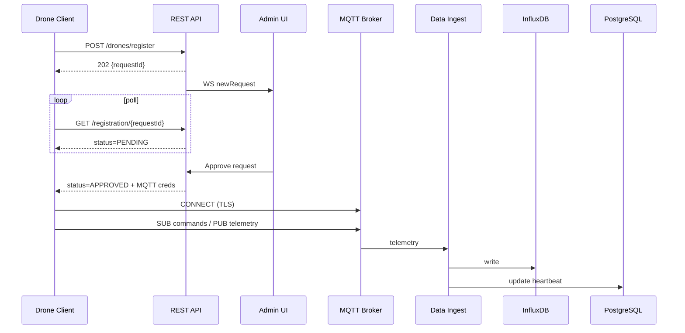

# Drone Client Developer Guide (MVP 0.1)

> 适用版本：backend v0.1 · 参考文件：`drone_management_system_core_design.md`、`smart_drone_simulator_pattern.py`

## 0. 读前须知

* **目标**：在 PX4 + ROS2 无人机上实现可下载、即装即用的边缘代理（Drone Client），完成注册、鉴权、MQTT 数据交换与基本命令执行。
* **术语**
  * **Drone Client**：本文所述边缘代理程序。
  * **后端**：`/api/v1` REST 服务 + MQTT Broker + 数据入库服务。
* **代码参考**：`smart_drone_simulator_pattern.py` 已完整实现业务流，可作为最小可运行示例。

---

## 1. 客户端职责

| 阶段 | 主要任务 |
|------|---------|
| 启动 | 解析本地 `config.yaml` → 若无凭据则发起注册 |
| 注册 | 调用 REST `/drones/register`，轮询审批 → 获取 `droneId` & MQTT 凭据 |
| 连接 | TLS-MQTT 连接；订阅命令主题；启动遥测定时器 |
| 桥接 | ROS <→ MQTT：遥测上报、命令翻译执行 |
| 监控 | 自监控、OTA、自恢复（预留） |

---

## 2. 后端 REST API

### 2.1 申请注册
`POST /api/v1/drones/register`
```json
{
  "serialNumber": "PX4-12345678",
  "model": "X500",
  "firmwareVersion": "1.14.0",
  "notes": "Companion Jetson"
}
```

*Response 202*
```json
{ "requestId": "9cc1e4a9-b17c-..." }
```

### 2.2 轮询注册状态
`GET /api/v1/drones/registration/{requestId}/status`

| 字段 | 说明 |
|------|------|
| `status` | `PENDING_APPROVAL` · `APPROVED` · `REJECTED` |
| `droneId` | 仅 APPROVED 时返回 |
| `mqttCredentials` | 详见下表 |

`mqttCredentials` 示例：
```json
{
  "mqttBrokerUrl": "tcp://mqtt.example.com:1883",
  "mqttUsername": "uav_4bf...",
  "mqttPassword": "KzF...",
  "mqttTopicTelemetry": "drones/4bf.../telemetry",
  "mqttTopicCommands":  "drones/4bf.../commands"
}
```
轮询建议间隔：10 s；连续失败 5 次回退重新注册。

### 2.3 命令回执（可选）
`POST /api/v1/drones/{droneId}/command_ack`
```json
{
  "commandId": "cmd-6e3e...",
  "result": "SUCCESS",
  "message": "Reached waypoint"
}
```

---

## 3. MQTT 协议规范

### 3.1 主题
| 方向 | 主题 | QoS |
|------|------|-----|
| UAV → 后端 | `drones/{droneId}/telemetry` | 0 / 1 |
| UAV → 后端 | `drones/{droneId}/heartbeat` | 0 |
| 后端 → UAV | `drones/{droneId}/commands`  | 1 |
| UAV → 后端 | `drones/{droneId}/command_ack` | 1 |
| UAV → 后端 | `drones/{droneId}/log` | 0 |

### 3.2 安全
* 账号：每架无人机独占，用户名格式 `uav_{droneId}`。
* 连接：MQTT over TLS；服务器验证 + 账号密码或客户端证书。
* ACL（EMQX 示例）
  ```
  {allow, {user, "uav_4bf..."}, pubsub, ["drones/4bf.../#"]}.
  ```

### 3.3 消息格式

#### Telemetry / Heartbeat
```json
{
  "timestamp": 1710077802.345,
  "latitude": 34.052200,
  "longitude": -118.243700,
  "altitude": 120.5,
  "batteryLevel": 72.3,
  "status": "FLYING",  // 详见 5.1
  "speed": 10.2,
  "heading": 87.6,
  "droneId": "4bf...e507"
}
```

#### Command（下发）
```json
{
  "commandId": "cmd-6e3e...",
  "type": "GOTO",            // TAKEOFF / LAND / RTL / ...
  "parameters": {
    "latitude": 34.0550,
    "longitude": -118.2500,
    "altitude": 100,
    "speed": 8.0
  }
}
```

#### CommandAck（上报，可选）
```json
{
  "commandId": "cmd-6e3e...",
  "result": "SUCCESS",
  "message": "Reached waypoint",
  "timestamp": 1710077830.125
}
```

---

## 4. 业务流程时序


---

## 5. 客户端实现要点

### 5.1 状态机
```
REGISTERING → PENDING_APPROVAL → CONNECTING_MQTT → IDLE
IDLE ↔ TAKING_OFF ↔ FLYING / PATTERN_FLYING ↔ LANDING
IDLE ↔ RTL
```

### 5.2 必要数据字段
| 阶段 | 字段 | 来源 |
|------|------|------|
| 注册 | `serialNumber` `model` | 读取硬件 / 参数 |
| 遥测 | `timestamp` `latitude` `longitude` `altitude` `batteryLevel` `status` | PX4 uORB / MAVROS / ROS2 |
| 回执 | `commandId` `result` | 客户端控制逻辑 |

### 5.3 PX4 / ROS 对接
* **首选** MAVROS 2：
  * 订阅 `/mavros/local_position/pose` 提取位置
  * 订阅 `/mavros/battery` 提取电量
  * 发布 `/mavros/setpoint_position/local` 实现 GOTO
* **后续** 可迁移 `px4_ros_com`（RTPS → DDS）。

### 5.4 离线容忍
* MQTT 断线 → 1→2→4→…32 s 指数回退重连。
* 遥测缓存 SQLite；恢复后批量 flush（可选）。

### 5.5 本地配置示例 `/etc/drone-client/config.yaml`
```yaml
backendUrl: https://api.example.com/api/v1
mqttHost: mqtt.example.com
mqttPort: 8883
serialNumber: PX4-12345678
model: X500
credentialsPath: /data/drone-client/credentials.json
telemetryInterval: 2
```

---

## 6. 开发 & 发布
1. **语言建议**：Go（静态单文件）或 Python（快速原型）。
2. **CI**：
   * `colcon build`（ROS 包）
   * `go build ./cmd/agent`（核心代理）
   * Docker 多架构推送 `ghcr.io/org/drone-client:{version}-{arch}`
3. **安装脚本**：
```bash
curl -sSL https://dl.example.com/install.sh | sudo bash -s -- --token abc123
```

---

## 7. 未来扩展
* 双向 TLS / JWT 轮换。
* 视频流 (RTSP → WebRTC)。
* Mission Planning、Geofence Enforcement。
* OTA 差分升级 + 签名校验。

---

## 8. 模拟器快速体验
```bash
python smart_drone_simulator_pattern.py \
  --backend_url http://localhost:8080/api/v1 \
  --mqtt_host localhost --mqtt_port 1883 \
  --flight_pattern RECTANGLE --rectangle_width 120 --rectangle_height 80 \
  --flight_altitude 30 --flight_speed 6
```

启动后可在管理系统后台看到虚拟无人机上线与飞行轨迹，用于端到端验证。 